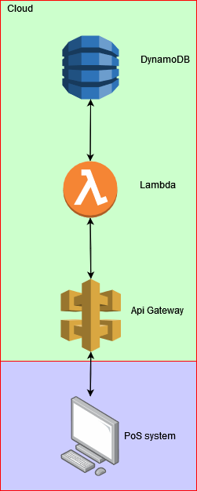

# SynopticProject API


## Express server with dynamoDB local for DB 

## Local setup requirements
```bash
>Nodejs v12
>java jdk 17+
>npm
```

## To run local DB and seed with example user data  
```bash
>cd DynamoDB
>java -Djava.library.path=../DynamoDBLocal_lib -jar DynamoDBLocal.jar -sharedDb
>cd ..
>npm run create-db
>npm run load-data
```

## To run express server
```bash
>npm install
>npm run start
```
# Testing

## Postman

Due to time constraints I have elected to forgo unit testing for the sake of ease of development on this MVP.
Unit tests would be realtively easy to add through the use of the NPM package 'supertest'. 
Tests for this API are done through postman app. 
Postman collection can be found in ./Postman
This collection can then be imported into postman and each requet can be manually sent


At present the user can perform a GET request to localhost:3000/ 
    This will return all users in the database - this is implemented for development purposes.
```bash
> GET /
```
The user can register by performing a POST request to localhost:3000/register
    The user will have to provide the following
 {
    "id": "String",
    "name": "String",
    "email": "String",
    "mobileNumber": "String",
    "pin": int
}
    This will create an entry with the given attributes in the database.
```bash
> POST /register 
```
The user can login by performing a GET request to localhost:3000/login/<UserID>/<UserPIN>
    This will return "Hello <name>"
    The server then sets four different cookies; "credit", "name", "userID", and "loggedIn".
    If the user provides the incorrect PIN they are sent statusCode 403 (Forbidden) and told the pin is incorrect. 
```bash
> GET /login/<userID>/<UserPIN>
```
The user can topUp their balance after logging in by performing a POST request to localhost:3000/topup
    The user will have to provide the following in the POST request body 
    {
        "ammount": Int
    }
```bash
> POST /topup
```
The user can then purchase by performing a POST request to localhost:3000/payment
    The user will have to provide the follow in the POST request body
    {
        "ammount": Int
    }
```bash
> POST /payment
```
The user can then logout by performing a second GET request to localhost:3000/login/<UserID>/<UserPIN>
    This will return "Goodbye <name>"
    The server will then destory all 4 cookies which it previously issued.
```bash
> GET /login/<UserID>/<UserPIN>
```

# Going foward 

 At present this app is an express server which is connected to an in-memory dynamoDB instance. 
 This could be run almost as is using cloud compute infrastructure such as EC2.
 But a more radical change could be to move the entire API to serverless architecture;
 This could be achieved by utilizing a cloud provider such as Azure/AWS and running the logic in serverless functions e.g AWS lambda.
 To complement this approach we could host the dynamoDB database in the cloud too, using AWS's dynamodb offering.
 and use API gateway to route requests and authenticate users. 
 This would allow for far greater scaling of the entire system and possibly lower costs in terms of hosting and maintaining servers.
 Another posible way to improve this code would be to use a more stronly typed language or Typescript. This would give far more confidence in what is being developed. 



Given more time I would have liked to refactor the project by spliting the dynamoDB functions into seperate files. This would make the overall structure of the API much more managable and easier to comprehend and read. 
It would also allow for the reuse of certain pieces of code, where currently there is significant duplication.

I would have liked to added some unit testing to this project, if given more time I would have certainly added unit tests around the refactored dynamoDB functions, just so that we have certainty and confidence surrounding how the application works and that it works in the way we expect it to.  
